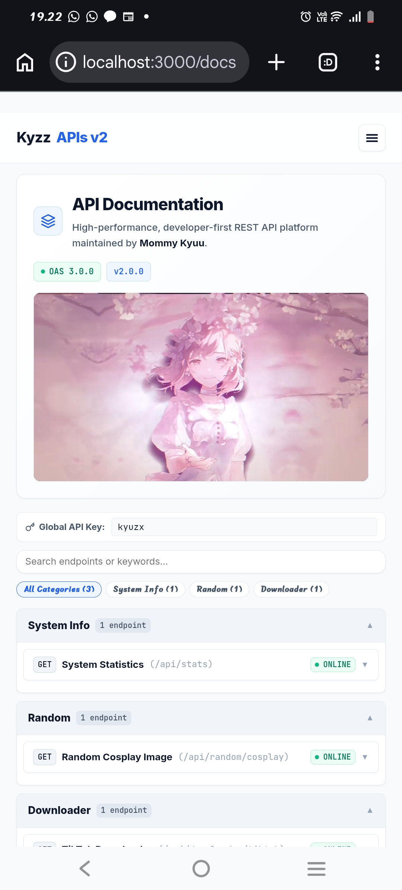
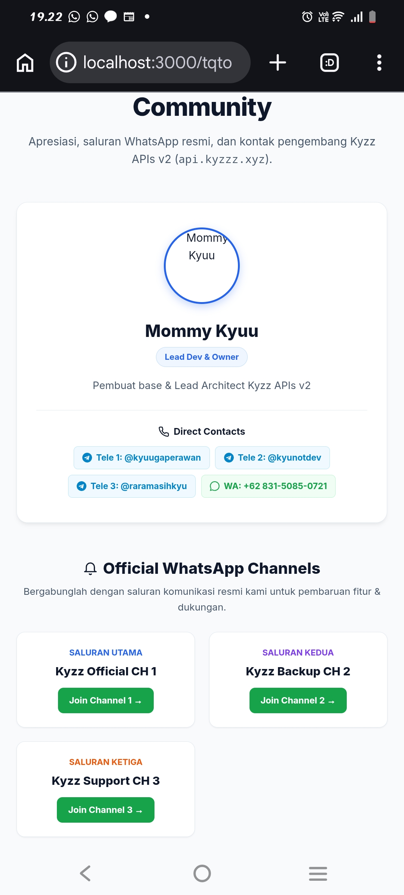
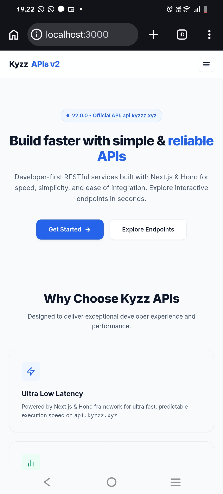
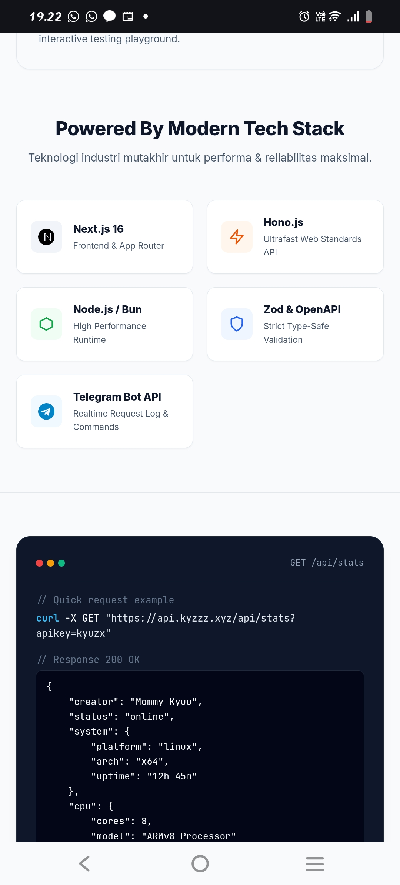
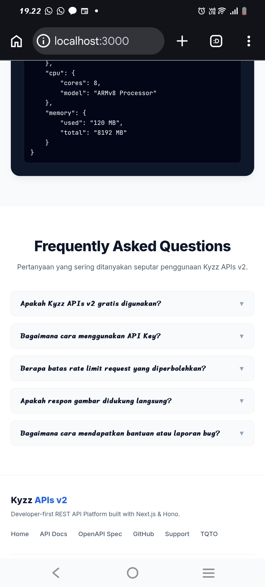

# ✨ Kyzz APIs v2 ✨

**High-Performance. Scalable. Type-Safe. REST API Platform.**  
*Powered by Next.js 16, Hono.js, NJS (Node.js/Bun), Zod Schema, & Swagger OpenAPI 3.0.0*

[](https://api.kyzzz.xyz)
[](https://github.com/RynnStecu/kyzz-apisv2)
[](https://whatsapp.com/channel/0029Vb7gcbuLdQelWzrTzD3D)
[](https://t.me/kyuugaperawan)


---

## 🖼️ DOKUMENTASI & INTERACTION PREVIEW







---

## 🛠️ TECH STACK LOGOS

[](https://nextjs.org)
[](https://hono.dev)
[](https://nodejs.org)
[](https://swagger.io)
[](https://www.typescriptlang.org)
[](https://zod.dev)

---

## 🌟 FITUR UNGGULAN (FEATURES)

| Fitur | Status | Deskripsi |
| :--- | :---: | :--- |
| **⚡ Ultrafast NJS Engine** |  | Backend ditenagai NJS / Node.js & Hono.js untuk latensi eksekusi teruji di `api.kyzzz.xyz`. |
| **📘 Swagger OpenAPI 3.0** |  | Dokumentasi OpenAPI 3.0 standar industri dengan interaksi coba endpoint langsung. |
| **🛡️ API Key Protection** |  | Proteksi middleware API Key (`?apikey=kyuzx`) pada seluruh rute `/api/*`. |
| **✨ Structured JSON Header** |  | Setiap respon JSON menyertakan header properti `creator: "Mommy Kyuu"` paling atas. |
| **🔑 Interactive Playground** |  | Input API Key global dengan `localStorage`, tag filter kategori, & latensi eksekusi `ms`. |
| **🤖 Telegram Request Log** |  | Log notifikasi otomatis ke owner via Telegram Bot dan balasan perintah `/stats` & `/ping`. |
| **🖼️ Auto-Responsive Render** |  | Render foto hasil endpoint gambar otomatis mengikuti rasio & ukuran asli gambar tanpa terdistorsi. |

---

## 📦 PANDUAN SETUP & INSTALASI (TERMUX & VPS LINUX)

### 📲 Setup di Termux (Android):

```bash
# 1. Update package repository & install Node.js + Git
pkg update -y && pkg upgrade -y
pkg install nodejs-lts git -y

# 2. Clone repository & masuk ke direktori
git clone https://github.com/RynnStecu/kyzz-apisv2.git
cd kyzz-apisv2

# 3. Install dependensi proyek
npm install

# 4. Salin environment file
cp .env.example .env

# 5. Jalankan server (Mode Production)
npm run build && npm start
```

### 🖥️ Setup di VPS Linux (Ubuntu / Debian):

```bash
# 1. Update paket sistem & install Node.js 20+ via NodeSource
sudo apt update && sudo apt upgrade -y
curl -fsSL https://deb.nodesource.com/setup_20.x | sudo -E bash -
sudo apt install -y nodejs git pm2 -g

# 2. Clone repository & masuk ke direktori
git clone https://github.com/RynnStecu/kyzz-apisv2.git
cd kyzz-apisv2

# 3. Install dependensi proyek
npm install

# 4. Salin environment file & sesuaikan TELEGRAM_BOT_TOKEN
cp .env.example .env

# 5. Build proyek & jalankan 24/7 menggunakan PM2
npm run build
pm2 start npm --name "kyzz-apis" -- start
pm2 save && pm2 startup
```

---

## 💡 CARA MEMBUAT ENDPOINT BARU (CREATE NEW ENDPOINT GUIDE)

Proyek ini menggunakan **Hono OpenAPI & Zod Schema**. Ikuti panduan mudah berikut untuk menambahkan endpoint baru:

### 1. Buat File Handler Baru di `src/api/<kategori>/<nama>.ts`

```typescript
// File: src/api/general/quote.ts
import { createRoute, z } from '@hono/zod-openapi'
import type { Context } from 'hono'

// Define OpenAPI Schema Route
export const quoteRoute = createRoute({
    method: 'get',
    path: '/api/general/quote',
    summary: 'Random Quote Endpoint',
    description: 'Mengembalikan kata-kata bijak acak beserta pembuatnya',
    tags: ['General'],
    'x-status': 'ONLINE',
    request: {
        query: z.object({
            apikey: z.string().openapi({ example: 'kyuzx', description: 'Valid API Key' })
        })
    },
    responses: {
        200: {
            content: {
                'application/json': {
                    schema: z.object({
                        status: z.boolean().openapi({ example: true }),
                        quote: z.string().openapi({ example: 'Tetap semangat pantang menyerah.' }),
                        author: z.string().openapi({ example: 'Mommy Kyuu' })
                    })
                }
            },
            description: 'Berhasil mendapatkan quote'
        }
    }
})

// Define Execution Handler
export const quoteHandler = async (c: Context) => {
    return c.json({
        status: true,
        quote: 'Kembangkan potensimu tanpa batas bersama Kyzz APIs v2.',
        author: 'Mommy Kyuu'
    }, 200)
}
```

### 2. Daftarkan Rute di `src/app.js`

```javascript
// File: src/app.js
import { quoteRoute, quoteHandler } from './api/general/quote.ts'

// Register Rute Baru
register(app, quoteRoute, quoteHandler)
```

---

## 🔑 CARA PENGGUNAAN API (QUICK START)

Seluruh endpoint API yang berada di bawah rute `/api/*` memerlukan query parameter `apikey`:

- **Official Domain:** `https://api.kyzzz.xyz`
- **Default API Key:** `kyuzx`

### 💻 Contoh Request cURL:
```bash
curl -X GET "https://api.kyzzz.xyz/api/stats?apikey=kyuzx"
```

### 📄 Contoh Respon JSON:
```json
{
    "creator": "Mommy Kyuu",
    "status": "online",
    "system": {
        "platform": "linux",
        "arch": "x64",
        "uptime": "12h 45m"
    },
    "cpu": {
        "cores": 8,
        "model": "ARMv8 Processor"
    }
}
```

---

## 📢 OFFICIAL WHATSAPP CHANNELS

[](https://whatsapp.com/channel/0029Vb7gcbuLdQelWzrTzD3D)
[](https://whatsapp.com/channel/0029VbCsmdMC1Fu6NbIaaY2T)
[](https://whatsapp.com/channel/0029VbDO8tI2phHLTSN2ed0U)

---

## 📞 KONTAK RESMI PENGEMBANG (OWNER CONTACTS)

| Platform | Handle / Kontak | Tautan Langsung |
| :---: | :--- | :--- |
|  | `@kyuugaperawan` | [t.me/kyuugaperawan](https://t.me/kyuugaperawan) |
|  | `@kyunotdev` | [t.me/kyunotdev](https://t.me/kyunotdev) |
|  | `@raramasihkyu` | [t.me/raramasihkyu](https://t.me/raramasihkyu) |
|  | `+62 831-5085-0721` | [wa.me/6283150850721](https://wa.me/6283150850721) |

---

## 📜 LISENSI (LICENSE)

Proyek ini dilindungi di bawah lisensi [MIT License](LICENSE). Anda bebas menggunakan, memodifikasi, dan mendistribusikan proyek ini selama mencantumkan nama pembuat asli (**Mommy Kyuu**).

---

**Developed with ❤️ by Mommy Kyuu**  
*Kyzz APIs v2 © 2026. All rights reserved.*
